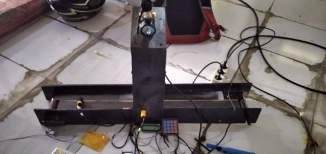
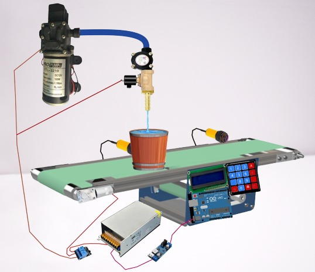
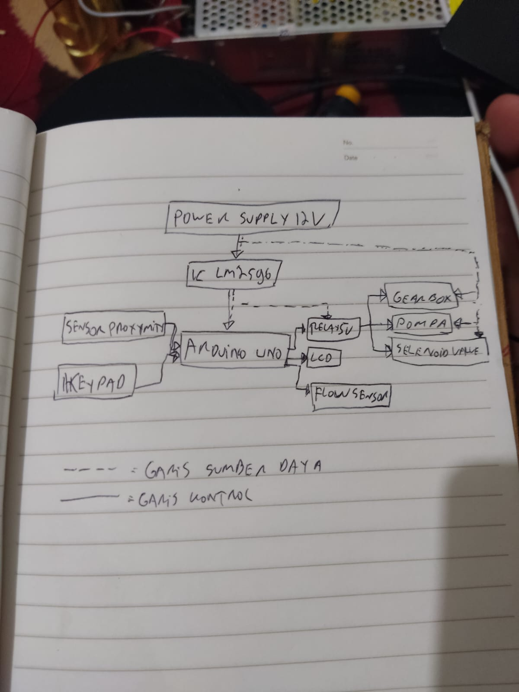
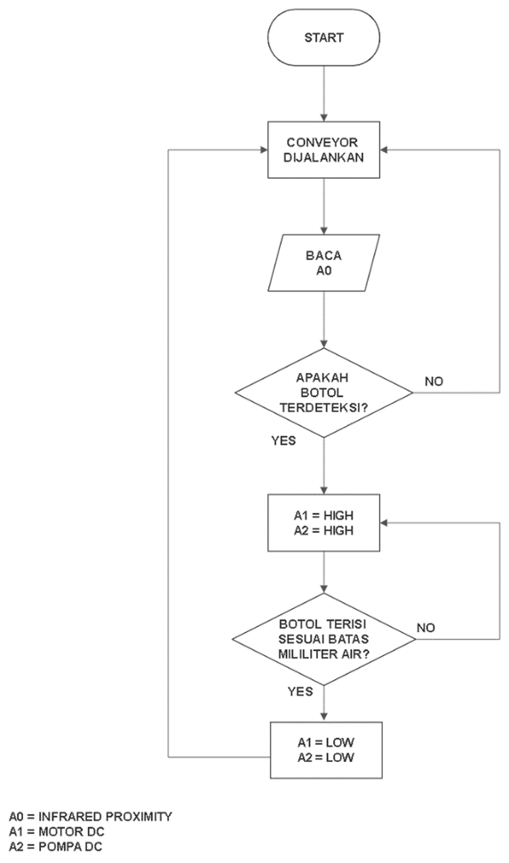
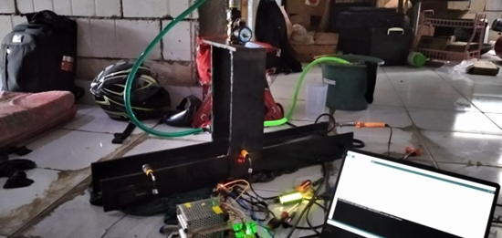

# Automatic Liquid Filling Machine (Arduino Uno)

 

Repositori ini berisi kode sumber Arduino dan dokumentasi untuk proyek "Automatic Liquid Filling Machine". Proyek ini merupakan tugas akhir matakuliah Sensor dan Tranduser yang dibuat oleh mahasiswa D4 Teknologi Rekayasa Sistem Elektronika, Universitas Negeri Malang pada Semester 3 (Desember 2022).

Tujuan utama proyek ini adalah merancang dan membangun prototipe mesin pengisi cairan otomatis sederhana menggunakan Arduino Uno, sensor, dan aktuator untuk mengisi wadah (botol) dengan volume cairan yang dapat diatur melalui keypad.

---

## Fitur Utama

  
 

* **Pengisian Otomatis:** Mengisi cairan ke dalam wadah secara otomatis ketika wadah terdeteksi di posisi pengisian.
* **Volume Terukur:** Pengguna dapat memasukkan target volume pengisian (dalam mililiter) melalui keypad matriks 4x4.
* **Pengukuran Aliran Real-time:** Menggunakan sensor aliran air (*water flow sensor*) untuk mengukur jumlah cairan yang telah dialirkan secara *real-time*.
* **Kontrol Konveyor:** Menggunakan motor DC dan sensor inframerah (*proximity*) untuk menggerakkan dan menghentikan konveyor mini secara otomatis.
* **Antarmuka Pengguna:** Menampilkan informasi volume target dan volume saat ini pada layar LCD I2C 16x2.
* **Penyimpanan Volume:** Menyimpan pengaturan volume terakhir ke memori EEPROM Arduino, sehingga nilai tetap tersimpan meskipun daya dimatikan.

---

## Komponen yang Digunakan

  
 

* **Mikrokontroler:** Arduino Uno
* **Input:**
    * Keypad Matriks 4x4
    * Sensor Infrared Proximity (2 buah)
    * Sensor Aliran Air (Water Flow Sensor) YF-S201 atau sejenisnya
* **Output:**
    * LCD I2C 16x2
    * Relay Module 5V (2 buah)
    * Pompa Air DC 12V
    * Motor DC dengan Gearbox (untuk konveyor)
    * Solenoid Valve 12V (Opsional, bisa dikontrol bersama pompa)
* **Daya:**
    * Power Supply 12V
    * Regulator Step-Down LM2596 (12V ke 5V untuk Arduino & sensor)
* **Mekanik:**
    * Konveyor Mini
    * Rangka Mesin
    * Selang, Wadah Air, Botol/Gelas Uji

---

## Cara Kerja

  
 

1.  **Inisialisasi:** Saat dinyalakan, LCD menampilkan pesan selamat datang, kemudian menampilkan UI utama. Nilai volume terakhir dibaca dari EEPROM. Konveyor mulai berjalan.
2.  **Deteksi Botol:** Ketika botol diletakkan di awal konveyor dan bergerak hingga mencapai Sensor IR 1 di posisi pengisian, sensor mendeteksi botol.
3.  **Penghentian Konveyor & Input Volume:** Arduino menghentikan motor konveyor. LCD menampilkan antarmuka untuk memasukkan volume target dalam mililiter. Pengguna memasukkan angka menggunakan keypad (maksimal 4 digit).
4.  **Penyimpanan & Mulai Pengisian:** Pengguna menekan tombol '#' (`S`) untuk menyimpan nilai volume ke EEPROM. Arduino mengaktifkan relay pompa air.
5.  **Pengukuran & Pengisian:** Pompa mulai mengalirkan air. Sensor aliran air mengirimkan pulsa ke Arduino. Arduino menghitung jumlah cairan yang telah terisi berdasarkan jumlah pulsa dan faktor kalibrasi. Volume saat ini ditampilkan di LCD.
6.  **Penghentian Pengisian:** Ketika volume terisi mencapai atau melebihi volume target, Arduino mematikan relay pompa.
7.  **Konveyor Berjalan Lagi:** Setelah jeda singkat, Arduino mengaktifkan relay motor konveyor lagi.
8.  **Penghentian di Ujung:** Botol bergerak hingga mencapai Sensor IR 2 di ujung konveyor. Sensor mendeteksi botol, dan Arduino menghentikan motor konveyor, menunggu botol diambil.
9.  **Siklus Berulang:** Setelah botol diambil dari ujung konveyor (Sensor IR 2 tidak mendeteksi), konveyor akan mulai berjalan lagi untuk siklus berikutnya.

---

## Pengaturan & Penggunaan

1.  **Upload Kode:** Upload file `automatic_liquid_filler.ino` ke Arduino Uno menggunakan Arduino IDE. Pastikan library `Keypad.h` dan `LiquidCrystal_I2C.h` sudah terinstal.
2.  **Wiring:** Hubungkan semua komponen sesuai dengan pin yang didefinisikan dalam kode dan skema rangkaian. **Perhatian:** Pastikan koneksi relay dan sumber daya eksternal (12V) sudah benar untuk menghindari kerusakan.
3.  **Kalibrasi Sensor Aliran:** Sesuaikan nilai `calibrationFactor` dalam kode berdasarkan pengujian dengan sensor Anda untuk akurasi volume yang tepat.
4.  **Operasi:**
    * Nyalakan sistem. Konveyor akan berjalan.
    * Letakkan botol di awal konveyor. Botol akan berhenti di bawah nozzle pengisian.
    * Masukkan target volume (1-9999 mL) menggunakan keypad numerik. Tombol `A`, `B`, `C` adalah *preset* (100, 250, 500 mL). Tombol `D` untuk menghapus digit terakhir.
    * Tekan `#` (`S`) untuk menyimpan dan memulai pengisian.
    * Tekan `*` untuk melihat volume yang tersimpan di EEPROM.
    * LCD akan menampilkan proses pengisian. Setelah selesai, pompa berhenti dan konveyor berjalan lagi.
    * Botol akan berhenti di ujung konveyor. Ambil botol tersebut.

**Video Demonstrasi:**

  
 

*(Klik gambar untuk melihat video)*

---
